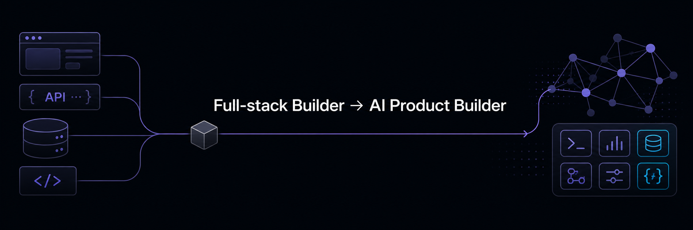

<div align="center">



<br/><br/>


<br/><br/>

<a href="https://www.linkedin.com/in/b2626826">
  
</a>
<a href="mailto:b2626826@gmail.com">
  
</a>
<a href="https://github.com/b2626826-blip?tab=repositories">
  
</a>

</div>

---

## About

I am currently learning full-stack development at iSpan while growing toward practical AI product development. I enjoy turning complex workflows into clear, reliable tools, especially around markets, developer experience, and decision-making.

> **Current path:** build solid web systems, explore AI capabilities, then ship useful tools.

| Step | Focus | What it means in practice |
|:--:|:--|:--|
| 01 | Build reliable web systems | Learn frontend, backend, APIs, databases, testing, and deployment fundamentals. |
| 02 | Explore AI capabilities | Experiment with LLM applications, retrieval, agents, evaluation, and human-in-the-loop workflows. |
| 03 | Ship useful tools | Apply both foundations to products that make information and decisions easier to work with. |

---

## What I Build

<details open>
<summary><b>UcMarket — Simulated Prediction Market Platform</b></summary>

<br/>

A full-stack prediction market built around virtual points. It supports market creation, moderation, trading, wallets, settlement, notifications, and rankings without real-money wagering.

`React` `Vite` `Java` `Spring Boot` `PostgreSQL` `Flyway`

[View repository](https://github.com/b2626826-blip/UcMarket)

</details>

<details>
<summary><b>TRADING — Personal Trading Journal</b></summary>

<br/>

A focused TypeScript application for recording trades, capital movements, strategies, and realised profit and loss in one personal workflow.

`TypeScript` `React` `Vite`

[View repository](https://github.com/b2626826-blip/TRADING)

</details>

<details>
<summary><b>CryptoPlan — Multi-Exchange Trading System</b></summary>

<br/>

A paper-first automated trading system exploring multi-exchange connectivity, normalised market data, fault isolation, and testable execution infrastructure.

`Python` `asyncio` `aiohttp` `WebSockets` `Docker`

[View repository](https://github.com/b2626826-blip/Cryptoplan)

</details>

<details>
<summary><b>EagleTab — Browser-Based Developer Workspace</b></summary>

<br/>

A local developer workspace that brings a real operating-system shell into the browser and adds file, URL, and Git-diff previews to the command-line workflow.

`Java` `Spring Boot` `React` `TypeScript` `WebSocket`

[View repository](https://github.com/b2626826-blip/EagleTab)

</details>

<details>
<summary><b>Alc-Run — Full-Stack Party Game</b></summary>

<br/>

A browser-based game with a TypeScript presentation layer and a Java backend responsible for game rules, state transitions, and settlement.

`TypeScript` `Vite` `Java` `Spring Boot`

[View repository](https://github.com/b2626826-blip/Alc-Run)

</details>

---

## Currently Learning

```yaml
full_stack:
  - Java and Spring Boot backend development
  - React and TypeScript frontend development
  - REST APIs, PostgreSQL, testing, and deployment basics

ai_product_development:
  - LLM application patterns and prompt design
  - Retrieval-augmented generation and evaluation
  - AI agents with clear human control points
  - Practical AI workflows for markets and developer tools
```

---

## Tech Stack

<div align="center">


<br/><br/>


</div>

---

## Progress Log

- Building end-to-end projects to strengthen product and system design fundamentals.
- Exploring how AI can make market information, developer workflows, and decisions more useful.
- Sharing work through public repositories and iterative project updates.

---

## GitHub Activity

<div align="center">


</div>

---

<div align="center">

<i>Turning curiosity into useful systems.</i>

<br/><br/>


</div>
